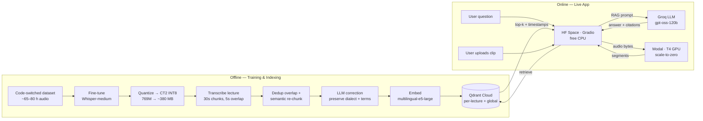

<!--
  NOTE: the YAML block above is required by Hugging Face Spaces.
  GitHub renders this file starting from the title below.
-->

# 🎙️ Muhadara RAG — Semantic Search for Code-Switched Lectures

> Ask a question about an Arabic/English university lecture — in **either language** —
> and get an answer grounded in the transcript, with **timestamps that point back to the exact moment** in the audio.

[](https://huggingface.co/spaces/Seif-Eldeen-Sameh/muhadara-rag)
[](https://huggingface.co/Seif-Eldeen-Sameh/whisper-medium-arabic-codeswitched)
[](LICENSE)

**Live demo:** https://huggingface.co/spaces/Seif-Eldeen-Sameh/muhadara-rag

---

## What it does

University lectures in the Arab world are often delivered in **code-switched speech** — Egyptian
Arabic dialect mixed mid-sentence with English technical terms ("يعني الـ gradient descent بيقلل الـ loss").
Off-the-shelf ASR mangles this. Muhadara RAG is an end-to-end system that:

1. **Transcribes** code-switched lecture audio with a fine-tuned Whisper model
2. **Indexes** the transcript into a vector database with timestamps preserved
3. **Answers questions** about the lecture via retrieval-augmented generation, citing the timestamp of every claim

Two modes in the live app:

| Tab | What happens | Latency |
|---|---|---|
| **📚 Demo Lecture** | Query a pre-indexed lecture | instant (CPU retrieval + LLM) |
| **🎤 Upload Your Own** | Upload a clip → GPU transcription → ask questions about *your* audio | ~3 s on GPU |

---

## Architecture



**Why this layout:** the always-on frontend is cheap (free CPU does retrieval + LLM API calls
fine), while the expensive part — GPU transcription — is a **serverless function that scales to
zero** and only costs anything when someone actually uploads audio. Managed services (Qdrant,
Groq) handle the stateful and latency-sensitive pieces.

---

## Stack

| Layer | Choice | Why |
|---|---|---|
| **ASR** | Fine-tuned [`whisper-medium-arabic-codeswitched`](https://huggingface.co/Seif-Eldeen-Sameh/whisper-medium-arabic-codeswitched), quantized to CTranslate2 INT8 | Base Whisper drops English terms or transliterates them; fine-tuning on code-switched data fixes this. INT8 = 2× smaller, 4× faster, runs on CPU. |
| **GPU inference** | [Modal](https://modal.com) serverless (T4) | Scale-to-zero serverless GPU; free monthly credit covers a demo. CPU fallback if unavailable. |
| **Embeddings** | [`multilingual-e5-large`](https://huggingface.co/intfloat/multilingual-e5-large) (1024-d) | Strong multilingual retrieval; handles Arabic + English in one space. |
| **Vector DB** | [Qdrant Cloud](https://cloud.qdrant.io) | Free tier; per-lecture collections + a global collection for cross-lecture fallback. |
| **LLM** | [Groq](https://groq.com) `gpt-oss-120b` | Fast, free tier; used for transcript correction, summarization, and RAG answering. |
| **Orchestration** | [LangChain](https://www.langchain.com) (LCEL) | Composable retrieval + prompt + LLM chains. |
| **Frontend** | [Gradio](https://www.gradio.app) on HF Spaces | Audio upload, chat UI, custom theme — permanent public URL. |

---

## Engineering decisions worth reading

These are the non-obvious problems and how they were solved — the actual work.

### 1. Timestamps survive the entire pipeline
Every chunk carries absolute `(start, end)` seconds from ingestion through dedup, re-chunking,
embedding, and storage. The RAG answer cites `[MM:SS]` for each claim, so a user can jump
straight to the source moment in the audio. This required threading timestamp metadata through
a fuzzy-dedup step that rewrites text — non-trivial to keep aligned.

### 2. Chunk overlap → fuzzy deduplication
Whisper is run on 30 s chunks with 5 s overlap (so no word is cut at a boundary). That overlap
then has to be *removed* before indexing or retrieval double-counts it. A Levenshtein-based
tail/head comparison detects and strips the shared span between consecutive chunks.

### 3. LLM correction that doesn't destroy the data
A naive "clean up this transcript" prompt rewrites Egyptian dialect into Modern Standard Arabic
and translates English technical terms — which *hurts* retrieval. The correction prompt is
explicitly constrained to fix only ASR errors (homophones, splits, punctuation) while preserving
dialect and code-switching verbatim, with a length-ratio guard that rejects over-eager rewrites.

### 4. Quantization for CPU-class deployment
The fine-tuned `whisper-medium` (769M params) was converted to CTranslate2 INT8 (~380 MB),
making CPU inference viable and GPU inference fast. See [`eval/`](eval/) for the measured
size/speed/quality tradeoffs.

### 5. Far-field audio investigation (a negative result, documented)
The original lecture recordings were far-field (phone on a desk, reverberant, quiet speaker). A
full denoising pipeline (DeepFilterNet + compression + LUFS normalization) was built and
benchmarked — but DeepFilterNet suppressed the *distant* main speaker while boosting nearer
voices, making ASR worse, not better. Conclusion: for this recording profile, light gain beats
aggressive enhancement. Knowing when *not* to add a stage is part of the job.

---

## Results

Reproduce these with [`eval/evaluation.ipynb`](eval/evaluation.ipynb) on a Colab GPU runtime.

### Transcription quality (WER ↓ better)

| Model | WER on code-switched test set |
|---|---|
| `openai/whisper-medium` (base) | **52.4 %** |
| `whisper-medium-arabic-codeswitched` (fine-tuned, this work) | **17.9 %** |
| **Absolute reduction** | **−34.5 points** |

The base model drops or transliterates English technical terms and pushes dialect toward MSA — both of which destroy retrieval quality downstream. The fine-tune preserves code-switching verbatim.

### Inference latency (40.8 s test clip, median of 3 runs)

| Variant | Device | Wall time | Real-time factor |
|---|---|---|---|
| CT2 INT8 | CPU (2 vCPU) | 82.94 s | 2.03× (slower than RT) |
| CT2 INT8 | T4 GPU | 2.49 s | **0.061×** |
| CT2 FP16 | T4 GPU | 2.34 s | **0.057×** |

**~33× speedup CPU → GPU** — this is exactly why the architecture offloads ASR to Modal's serverless GPU instead of running it on the always-on CPU Space. The frontend stays free; the expensive compute is bursty and scale-to-zero.

---

## Repository layout

```
muhadara-rag/
├── app.py                  # Gradio frontend (2 tabs)
├── utils.py                # Embeddings, vector stores, RAG chains, Modal ASR client
├── modal_asr.py            # Serverless GPU ASR microservice (deploy separately)
├── style.css               # Custom theme
├── requirements.txt
├── packages.txt            # System deps (ffmpeg)
├── .github/workflows/
│   └── deploy.yml          # CI: auto-deploy to HF Space on push to main
├── docs/
│   └── architecture.md     # Detailed design notes
├── eval/
│   └── evaluation.ipynb    # WER + latency benchmarks
└── assets/
    └── demo.mp3            # Pre-baked demo lecture audio
```

---

## Run it yourself

### Frontend (local)
```bash
git clone https://github.com/Seif-Eldeen-Sameh/muhadara-rag
cd muhadara-rag
pip install -r requirements.txt
export QDRANT_URL=...  QDRANT_API_KEY=...  GROQ_API_KEY=...
python app.py
```

### GPU ASR service (Modal)
```bash
pip install modal
modal token new
modal deploy modal_asr.py          # prints a public URL
# then set MODAL_ASR_URL + MODAL_ASR_TOKEN in the frontend's env / Space secrets
```

Without `MODAL_ASR_URL` set, the app transparently falls back to local CPU transcription.

---

## License

MIT — see [LICENSE](LICENSE).

Built by [**Seif Eldeen Sameh**](https://huggingface.co/Seif-Eldeen-Sameh).
Fine-tuned model and dataset are on the [Hugging Face Hub](https://huggingface.co/Seif-Eldeen-Sameh).
