# Architecture & Design Notes

Detailed companion to the README. This documents *why* the system is shaped the way it is.

## System overview

Muhadara RAG splits cleanly into an **offline pipeline** (training + indexing, run in
notebooks/Colab) and an **online serving layer** (the always-on app).

```mermaid
flowchart TB
    subgraph Offline
        direction LR
        A1[Audio/video file] --> A2[ffmpeg → 16kHz mono WAV<br/>30s chunks · 5s overlap]
        A2 --> A3[faster-whisper CT2 INT8<br/>VAD + hallucination guard]
        A3 --> A4[Overlap dedup<br/>Levenshtein tail/head]
        A4 --> A5[Semantic re-chunk<br/>30–120 words]
        A5 --> A6[LLM correction · Groq<br/>preserve dialect + terms]
        A6 --> A7[Embed · e5-large<br/>passage: prefix]
        A7 --> A8[(Qdrant upsert<br/>lecture_* + global)]
        A6 --> A9[Summarize · Groq] --> A8
    end

    subgraph Online
        direction LR
        B1[Question] --> B2[Embed · query: prefix]
        B2 --> B3{Per-lecture<br/>search}
        B3 -->|score ≥ 0.70| B5[Format context<br/>with timestamps]
        B3 -->|score < 0.70| B4[+ global search<br/>fallback] --> B5
        B5 --> B6[RAG prompt → Groq] --> B7[Answer + MM:SS citations]
    end
```

## Key components

### Ingestion & chunking
- All input normalized to 16 kHz mono WAV (Whisper's expected format).
- 30 s chunks with **5 s overlap** so no word is severed at a boundary.
- Each chunk carries `ChunkMetadata` with absolute `(start_sec, end_sec)` that travels the
  whole pipeline.

### ASR
- Fine-tuned `whisper-medium` → CTranslate2 INT8.
- RMS-based VAD skips silent chunks; a 3-gram repetition guard catches Whisper hallucination
  loops.
- Word timestamps are offset by the chunk start to become absolute source-file timestamps.

### Deduplication
The 5 s overlap means consecutive chunks share text. `deduplicate_segments` normalizes both,
finds the longest matching prefix between the previous chunk's tail and the current chunk's head
(Levenshtein-gated), and strips it — while keeping the surviving text's timestamps intact.

### Semantic re-chunking
ASR segments are uneven. They're merged/split into 30–120 word blocks so embeddings capture a
coherent unit of meaning, with the block's `(abs_start, abs_end)` set from its constituent
segments.

### LLM correction
Constrained Groq prompt: fix homophones / splits / punctuation, **never** MSA-ify dialect or
translate English terms. A length-ratio guard (`0.5 ≤ corrected/original ≤ 2.0`) rejects
runaway rewrites and falls back to the original text.

### Retrieval with fallback
Search the per-lecture collection first. If the top score is below 0.70 (weak match), also search
the global collection (which holds lecture-level summaries) and merge — so a question that
doesn't match this lecture can still surface a relevant one.

### Robust payload reading
The retriever reads Qdrant payloads tolerant of both flat (older upserts) and nested-`metadata`
(LangChain default) layouts, so timestamps are always found regardless of how a point was written.

## Serving topology

| Concern | Where it runs | Rationale |
|---|---|---|
| UI, retrieval, LLM calls | HF Space (free CPU) | Cheap, always on; these are light. |
| GPU transcription | Modal (T4, scale-to-zero) | Expensive but bursty; pay only on upload. |
| Vector search | Qdrant Cloud | Managed, stateful, free tier. |
| LLM | Groq API | Fast, free tier. |

The frontend calls Modal over HTTP with a shared-token header; if `MODAL_ASR_URL` is unset or the
call fails, it transparently falls back to local CPU `faster-whisper`. No hard dependency on the
GPU service.

## Deliberate non-goals (v1)
- No user accounts or persistence of uploads (in-memory, per-session).
- No multi-lecture corpus UI (the global collection exists but isn't surfaced as a feature).
- No real-time streaming ASR (batch transcription of finite clips only).
